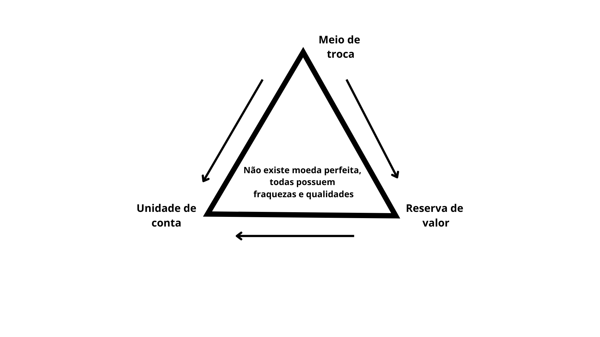

# A utilização da tecnologia Blockchain como moeda

&emsp; A história da moeda é uma narrativa fascinante que acompanha a evolução das sociedades humanas – do escambo, passando pelo uso de objetos de valor intrínseco (como conchas, gado e metais preciosos), até a invenção da moeda como meio de troca, unidade de conta e reserva de valor. Hoje, vivemos uma nova revolução: a blockchain, que propõe não apenas um novo tipo de moeda, mas uma transformação na maneira como entendemos e administramos a confiança nas transações.

 

&emsp; A moeda é um instrumento econômico que cumpre funções essenciais para o funcionamento das sociedades modernas. Ela é definida por três funções principais:
  - Meio de troca: Facilita a comercialização de bens e serviços, superando as limitações do escambo – onde era necessário haver uma “dupla coincidência de vontades” entre as partes.
  - Unidade de conta: Serve como uma referência padronizada para a mensuração de valores, permitindo que produtos, serviços e ativos sejam comparados e precificados de forma consistente.
  - Reserva de valor: Permite o armazenamento de riqueza para utilização futura. Embora seu poder de compra possa variar devido a fatores como a inflação, a capacidade de preservar valor ao longo do tempo é fundamental. 

## A história do dinheiro no Brasil 

&emsp; A história econômica do Brasil nos ensina lições importantes sobre os riscos de uma gestão centralizada da moeda. Durante os anos 1990, por exemplo, o bloqueio de contas, adotado pelo governo Collor, abalou profundamente a confiança da população e evidenciou como medidas centralizadas podem gerar insegurança e instabilidade. Naquele período, além de intervenções drásticas, o país enfrentava a hiperinflação, um fenômeno que corroía o poder de compra da população e semeava incertezas quanto ao valor real da moeda. A escalada dos preços e a constante desvalorização dos ativos financeiros criavam um ambiente de crise, onde o cidadão comum não sabia ao certo qual seria o valor de seus recursos no futuro.

&emsp; O lançamento do Plano Real, embora tenha sido um marco na estabilização da economia, trouxe à tona outra faceta dos sistemas centralizados: a dependência exclusiva de decisões governamentais para manter o equilíbrio monetário. Embora o novo modelo tenha conseguido conter a inflação e restaurar a confiança na moeda, ele também mostrou que, quando o controle está concentrado em mãos de um único agente – no caso, o Estado – o sistema fica suscetível a erros, manipulações e crises decorrentes de escolhas políticas que nem sempre atendem aos interesses de todos. Essa conjuntura histórica ressalta a vulnerabilidade dos modelos centralizados e a necessidade de explorar alternativas que ofereçam maior resiliência e transparência.

## Moeda descentralizada

&emsp; É nesse contexto que a tecnologia blockchain desponta como uma solução revolucionária e descentralizada para os problemas enfrentados pelos sistemas tradicionais. Diferente das moedas emitidas e controladas por um único ente central, a blockchain distribui as informações em um livro-razão que é mantido e atualizado por milhares de computadores espalhados pelo mundo. Cada transação é verificada através de um mecanismo de consenso, o que elimina a necessidade de uma autoridade central para autorizar ou validar as operações financeiras. Essa estrutura descentralizada reduz drasticamente os riscos de manipulação e corrupção, promovendo um ambiente mais seguro e confiável para a realização de transações.

&emsp; Além disso, a segurança proporcionada pela blockchain se baseia em criptografia avançada, garantindo que cada transação seja registrada de forma imutável. Os dados são agrupados em blocos que, uma vez interligados, formam uma cadeia auditável por qualquer participante da rede. Essa transparência não só fortalece a confiança dos usuários, como também permite que qualquer tentativa de alteração maliciosa seja rapidamente detectada. Outro aspecto fundamental é a eficiência que a tecnologia proporciona: ao eliminar intermediários, como bancos e outras instituições financeiras, as transações se tornam mais rápidas e com custos significativamente reduzidos, facilitando a comunicação direta entre os participantes.

&emsp; A partir da análise desses dois cenários – o histórico centralizado e os desafios enfrentados pelo Brasil, e a inovadora proposta da blockchain – podemos perceber que a descentralização oferece uma alternativa promissora para superar os problemas que assolaram os sistemas tradicionais. Essa nova abordagem não só redefine o conceito de moeda, mas também abre caminho para uma economia global mais justa, eficiente e menos vulnerável a crises e manipulações.

## Conclusão

&emsp; É com esta pequena análise histórica que iniciamos nossa jornada, nada melhor do que justificar do porquê estamos aqui, conforme o white paper de Satoshi Nakamoto o criado anônimo do Bitcoin, que se deu início a grande revolução na computação e do mundo, muitas pessoas possuem esta visão retrógrada de blockchain sendo somente um meio de transacionar, porém, já faz alguns anos que esta visão é equivocada, arrisco-me a dizer que blockchain enquanto ramo de computação seja um mundo quase infinito, o mundo ainda não está preparado para o “BOOM” da blockchain que está por vir.

